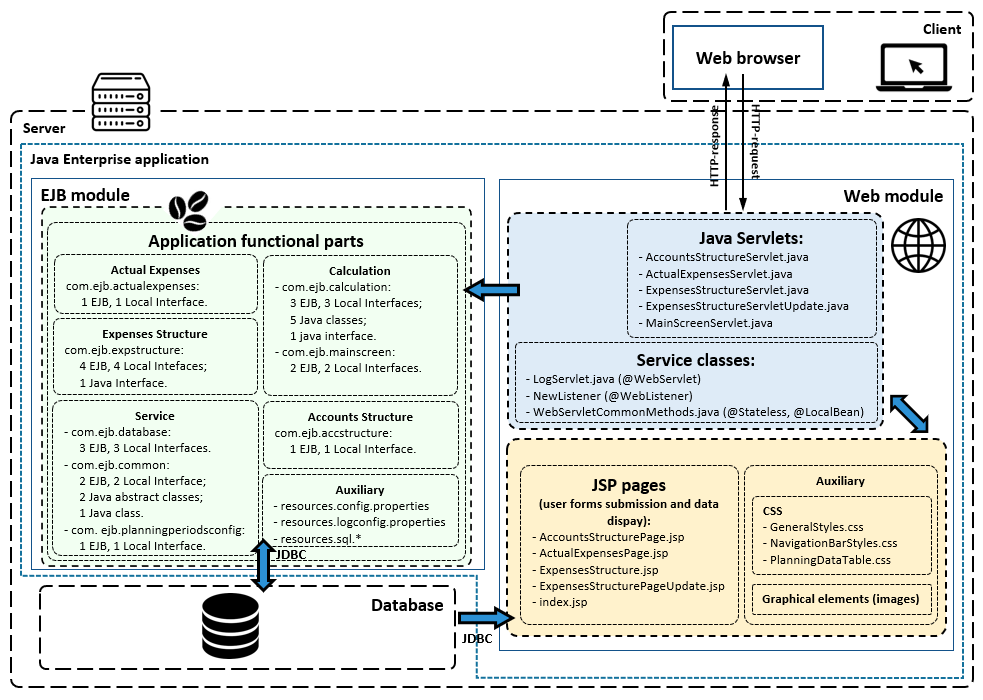
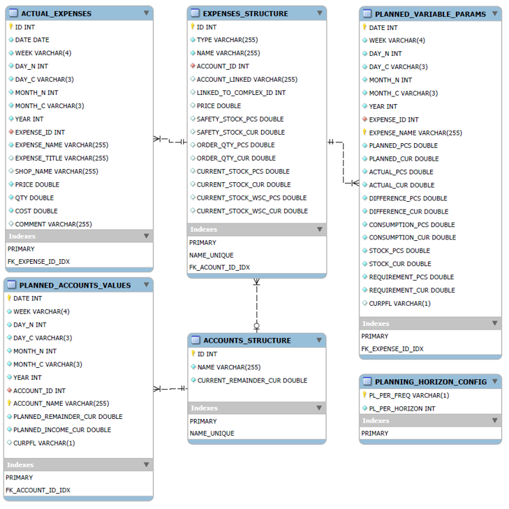
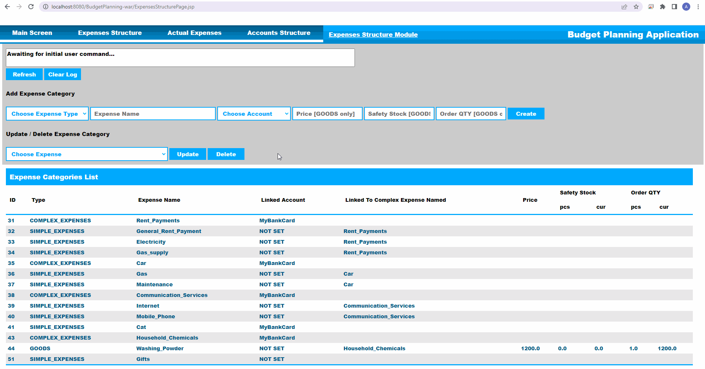
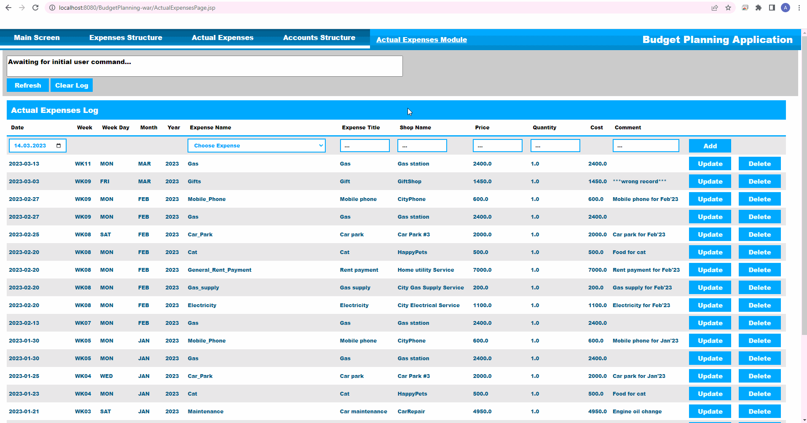
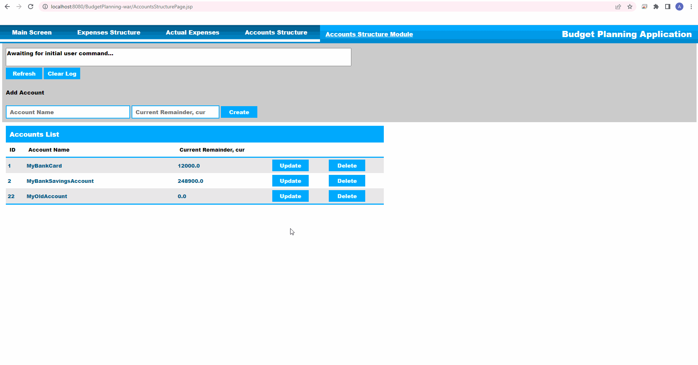

# BudgetPlanning
Java Enterprise application for maintaining a personal (family) budget.

### Purpose
In this project, the **budget** is understood as a **_financial plan_** (items of expense and income), drawn up for a certain period of time (_“planning horizon”_). 

The **objective** of budgeting is _reaching the personal financial goals_ which include completion of the following targets:
- accounting for expenses and income;
- analysis of expenses and income;
- expenses distribution / optimization;
- budget control.

This is my _graduation project_ that I completed during my education as an _Application Software Developer (Java)_.

### Project description
This Java Enterprise application is a tool for maintaining a personal (family) budget which includes working with expense categories and accounts, keeping records of actual expenses, tracking account balances, and plan expenses for future time periods, taking into account financial possibilities.

This project uses the following **technologies**: JDK17, Glassfish server 6.2.5 (Jakarta EE 9.1), Servlets & JSP / JSTL, HTML / CSS, JavaScript / JQuery, JSON, EJB, Apache Derby DBMS (SQL), Maven.

The application is implemented according to the following requirements.

**Non-functional requirements:**

- implemented as a Java Enterprise application;
- runs on a local network (deployed on a local server);
- uses all the necessary data from the local database;
- has a web UI (based on JSP pages).

**Functional requirements:**

The application allows:
- planning horizon up to 24 weeks (with a period of 1 week);
- work with expense categories (changing the structure, the list of expenses, and the attributes, calculating values);
- track the actual expenses by categories of expenses;
- work with accounts (changing the list of accounts, tracking account balances);
- change / calculate parameter values in each time period on the entire planning horizon;
- change the current period with a shift of 1 period.

### Application design and implementation details
The application **architecture** is based on MVC pattern as presented below. 

**Database structure** is presented below.

**UI**

The application has **_5 functional screens_** (JSP pages):
- Main Screen (control and analysis of the overall financial plan)
- Expenses Structure (add / delete expense category)
- Expenses Structure (change expense category parameter values)
- Actual Expenses (add, delete, adjust records of actual expenses)
- Accounts Structure (add, delete, adjust accounts)

The functional screens have controls (top navigation bar, data entry / submission form elements: text fields, drop-down lists, buttons) and display elements (data tables).

### Usage examples and UI demo

The **Expenses Structure _(add / delete expense category)_** screen usage demo

The **Expenses Structure _(change expense category parameter values)_** screen usage demo

The **Actual Expenses** screen usage demo

The **Accounts Structure** screen usage demo

The **Main Screen** usage demo

